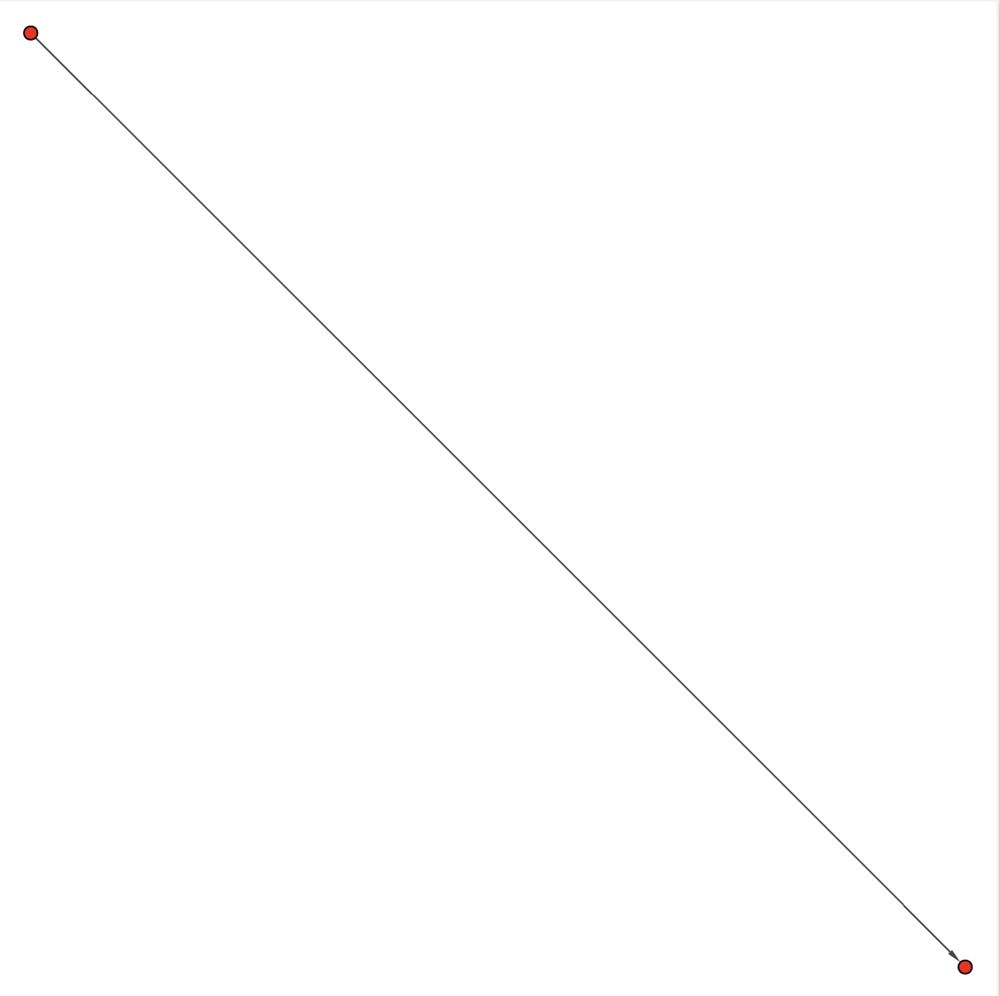
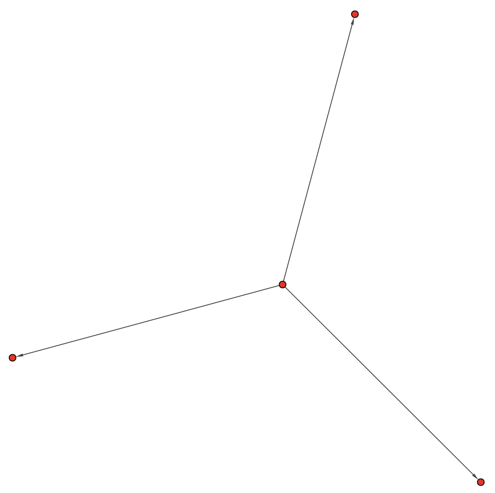
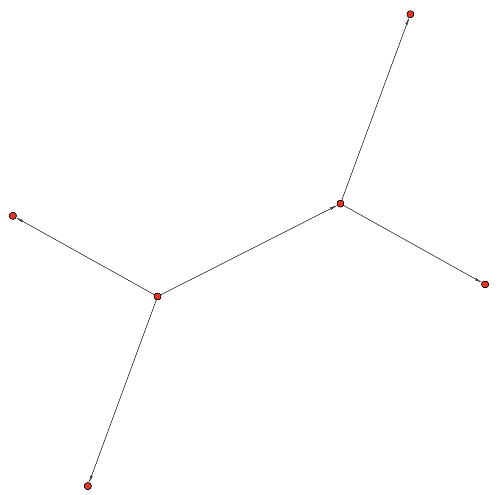
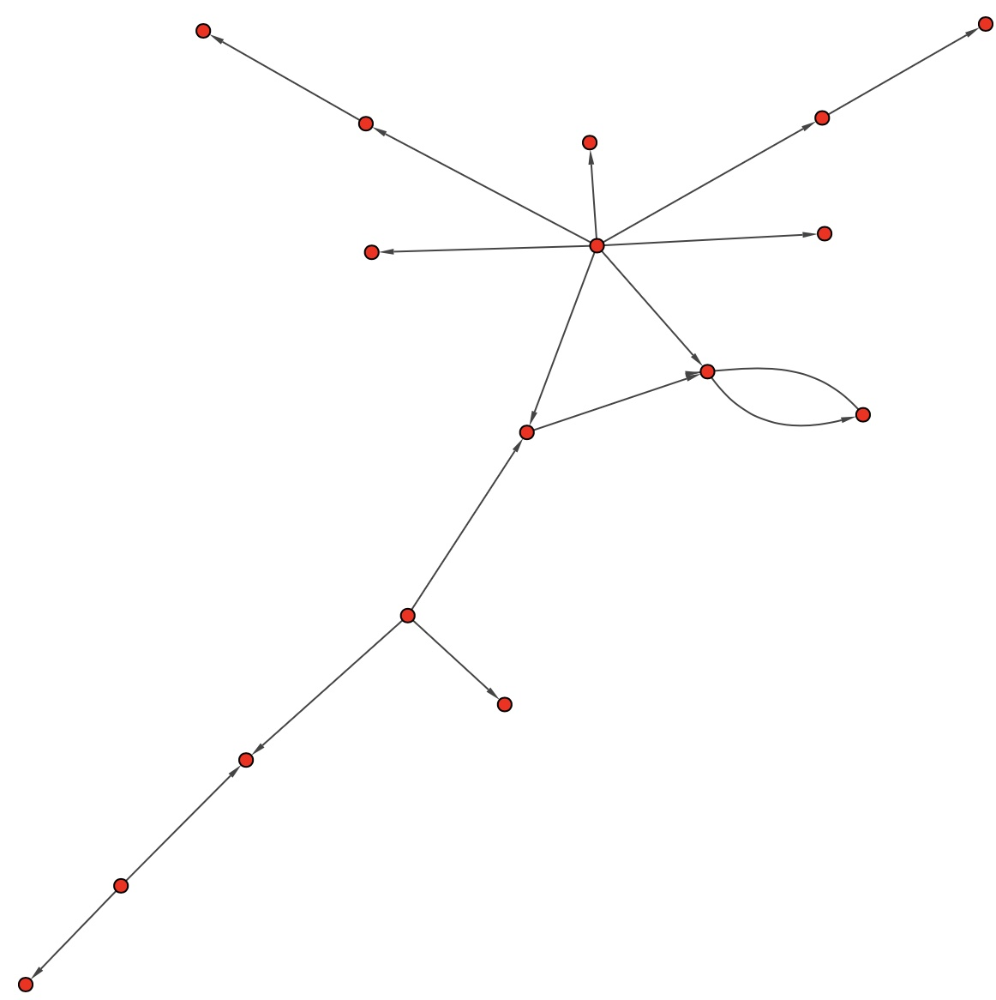
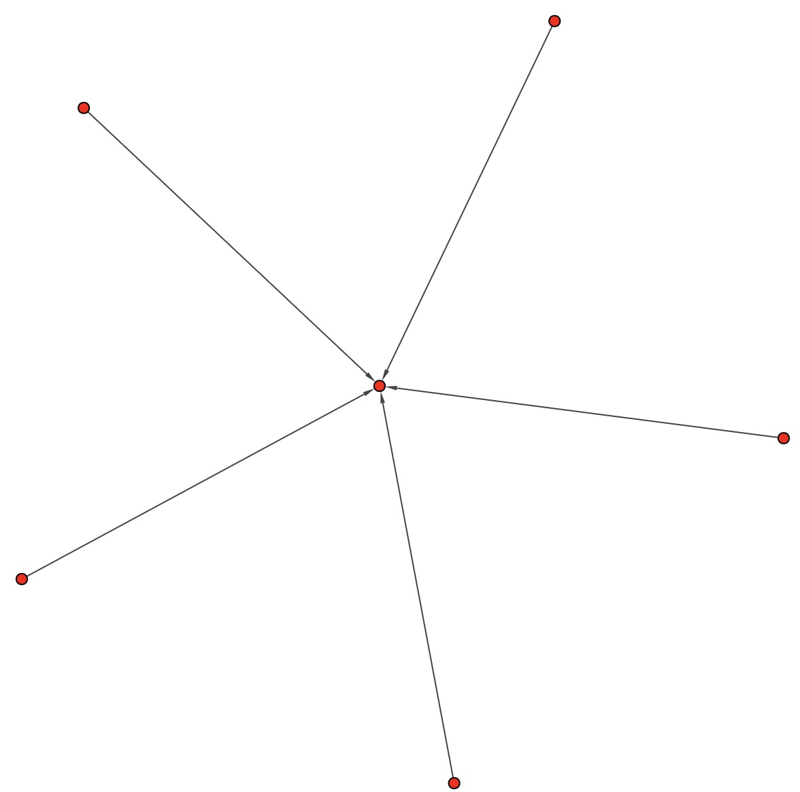

# Cluster Shape Coding guide

This is a coding guide for labelling cluster shapes. This coding guide includes three parts:
1. what materials we have for coding;
2. an operating manual that explains what the steps are for labelling the materials;
3. a Codesbook that explains what codes we have, and how the codes are defined.

## Materials for Coding
We have already prepared meterials for coding in `../figures/TensorFlow` and `../figures/PyTorch` folder respectively, which contains visualizations for the 131 and 100 detected communities in TensorFlow SC and PyTorch SC respectively.

## Operating Manual
The steps of labeling guidelines are as follows:
1. Get familliar with the coding materials and the Codesbook.
    - Inspect all the community visulizations in `../figures/TensorFlow/` folder and `../figures/PyTorch/` folder;
    - Read the Codesbook, which describes the codes we define for labelling. In the Codebook, we provide the name, definition, and example for each code. We also list some labelling rules after the table to help resolve ambiguities and the conflicts encountered in our labelling process.

2.  Conduct coding. For each visualization, carefully inspect its shape, label them with matching codes. Each visualization is assigned to one code.

## Codesbook
- **Arrow** cluster.

  - Definition: Arrow clusters contain only two packages, with one depending on the other.

  - Example:

    

- **Star**

  - Definition: Star clusters more than two packages, among which a packages is dependent by the other packages directly.

  -Exmaple:

    

- **Tree** cluster:

  - Definition: Tree clusters contain more than two packages. In these clusters, there is a root package on which most of the other packages directly or transitively depend.

  - Example:
    

- **Forest** cluster:

  - Definition: Forest clusters are similar to Tree clusters, but there are more than one packages on which the other packages directly or transitively. Compared with Star clusters, transitive dependencies exist in Tree clusters

  - Example:
    

- **Other** cluster:

  - Definition: Clusters that can not be classified to the above shapes.

  - Example:

    
